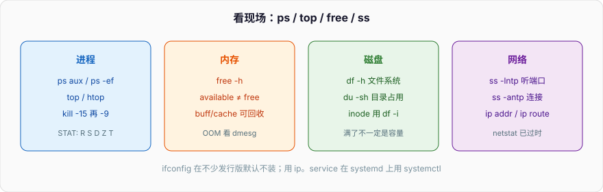
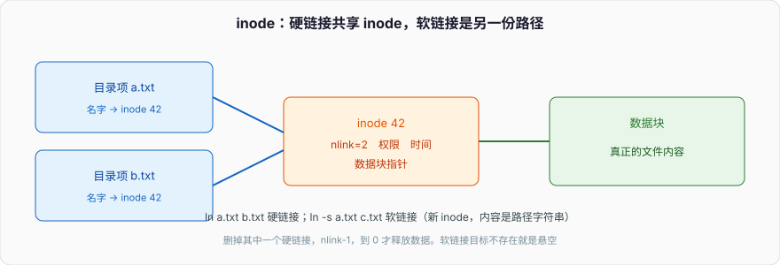

# 常用的Linux命令

排障时不要从 `ls` 一路背到 `useradd`。先按「进程 / 内存 / 磁盘 / 网络」四块定位，再用下面的命令把细节挖出来。



权限位和硬链接/软链接是面试高频，单独看这两张：




## 1、ls

`ls`（list）是一个用于列出目录内容的常见的Linux/Unix命令。它用于查看目录中包含的文件和子目录，以及它们的属性。

基本语法：

```Bash
ls
ls -l (详细列表)
```

- `-l`：以长格式（详细信息）列出文件和目录。

```C++
ls -l
```

- `-a`：显示所有文件，包括隐藏文件（以`.`开头的文件和目录）。

```C++
ls -a
```

- `-h`：以人类可读的方式显示文件大小。

```C++
ls -h
```

- `-t`：按修改时间排序文件和目录。

```C++
ls -t
```

- `-r`：以相反的顺序列出文件和目录。

```C++
ls -r
```

- `-R`：递归列出子目录的内容。

```C++
ls -R
```

- `-S`：按文件大小排序。

```C++
ls -S
```

- `--color`：启用彩色输出，以区分不同类型的文件。

```C++
ls --color
```

- `-i`：显示文件的inode号。

```C++
ls -i
```

- `-d`：仅显示目录本身，而不显示其内容。

```C++
ls -d
```

## 2、cd切换目录

```Bash
cd directory_path
```

## 3、pwd显示当前工作目录

```Bash
pwd
```

## 4、touch创建空文件

```Bash
touch filename
```

## 5、mkdir创建新目录

```Plain
mkdir directory_name
```

## 6、rm删除文件或目录

**rm** (remove)，是一个基本的 UNIX 命令，在 Linux 系统中是一个非常重要的命令，用于删除文件或目录。同时这也是一个应谨慎使用的命令，错误的使用此命令可能会删除重要的文件和数据。要使用 rm 删除文件，用户不需要具有读取/写入权限，但是必须有该文件上级目录的写入权限。在 Linux 中删除文件或目录不像 Windows 那样简单，因为一旦删除文件，它不会进入回收站而是完全删除，之后要想恢复非常困难的。

```Bash
rm file_name
rm -r directory_name (递归删除目录)
```

- `-f, --force`: 在没有确认删除提示的下删除文件并忽略不存在的文件和参数
- `-i`: 删除文件前提示确认
- `-I`: 在删除三个以上的文件或递归删除文件之前提示确认，与 -i 选项相比，侵入性较小，同时提供防止频繁错误的保护。
- `-interactive [=WHEN]`: 根据指定的 WHEN 进行确认提示：never，once (-I)，always (-i)，如果此参数不加 WHEN 则总是提示
- `--one-file-system`: 递归删除一个层级时，跳过所有不符合命令行参数的文件系统上的文件
- `--no-preserve-root`: 不对根目录 ‘/’ 进行任何特殊处理
- `--preserve-root [=all]`: 不对根目录 ‘/’ 进行递归操作（默认启用）
- `-r, -R, -recursive`: 以递归方式删除目录及其内容
- `-d, --dir`: 不使用 -r/-R/-recursive 删除空目录，`rm -dir` 等同于 `rmdir`
- `-v, --verbose`: 显示正在进行的步骤
- `--help`: 显示可用的命令选项
- `--version`: 输出 rm 命令的版本信息

## 7、cp复制文件或目录

```Bash
cp source_file destination
```

## 8、mv移动或重命名文件

```Bash
mv old_name new_name
```

## 9、cat查看文件内容

```Bash
cat file_name
```

## 10、grep在文件中搜索文本

```Perl
grep pattern file_name
```

## 11、ps显示运行中的进程

```Java
ps aux (显示所有进程)
```

## 12、kill终止进程

```Bash
kill process_id
```

## 13、top查看系统资源使用情况

```CSS
top
```

## 14、ifconfig查看和配置网络接口

```Plaintext
ifconfig
```

## 15、ping测试网络连接

```Plaintext
ping host_or_ip
```

## 16、ssh远程登录到其他机器

```CSS
ssh username@hostname_or_ip
```

## 17、scp安全复制文件到远程主机

```Ruby
scp source_file username@hostname_or_ip:destination
```

## 18、chmod修改文件权限

`chmod` 改的是权限位。`r=4, w=2, x=1`，三组分别是所有者、所属组、其他人。`chmod 755 file` 就是 `rwxr-xr-x`。目录的 `x` 表示「能否进入该目录」：没有执行位就不能 `cd`，即使有读权限也列不全路径下的内容。

```bash
chmod 755 file_name
chmod u=rwx,go=rx file_name
```

## 19、chown修改文件所有者

```Bash
chown new_owner file_name
```

## 20、tar压缩和解压文件

```Plaintext
tar -cvzf archive_name.tar.gz directory_to_compress
tar -xvzf archive_name.tar.gz
```

## 21、df显示磁盘使用情况

```Bash
df
```

## 22、du显示目录占用的磁盘空间

```Bash
du -h directory_name
```

## 23、find在文件系统中搜索文件

```Lua
find /path/to/search -name filename
```

## 24、wget下载文件

```Plain
wget URL
```

## 25、curl使用URL执行操作

```Plain
curl URL
```

## 26、git版本控制工具

```Bash
git clone repository_url
```

## 27、lsof列出打开的文件和套接字

```CSS
lsof -i
```

## 28、ss / netstat 看连接和监听

`netstat` 在不少发行版已经不默认安装。优先用 `ss`：

```bash
ss -lntp          # 监听的 TCP 端口和进程
ss -antp          # 当前连接
ss -s             # 汇总
```

还在用 netstat 的机器：

```bash
netstat -tuln
```

网络接口不要再记 `ifconfig`（`net-tools` 包，很多镜像不带）。看地址和路由用：

```bash
ip addr
ip route
```

## 29、ssh-keygen生成SSH密钥

```Plaintext
ssh-keygen
```

## 30、useradd创建新用户

```Plaintext
useradd username
```

## 31、passwd更改用户密码

```Plaintext
passwd username
```

## 32、ln创建链接（硬链接或符号链接）

硬链接：`ln a.txt b.txt`，两个目录项指向同一个 inode，删一个只是 `nlink-1`，到 0 才释放数据。软链接：`ln -s a.txt c.txt`，新 inode 里存的是路径字符串，目标不存在就是悬空。

```bash
ln source_file link_name      # 硬链接
ln -s source_file link_name   # 软链接
```

## 33、systemctl / service 管服务

SysV 的 `service` 在 systemd 机器上是一层包装。直接用：

```bash
systemctl start|stop|restart|status nginx
systemctl enable nginx     # 开机启动
```

老机器才写：

```bash
service service_name start|stop|restart
```

## 34、free显示内存使用情况

```Bash
free
```
